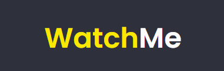
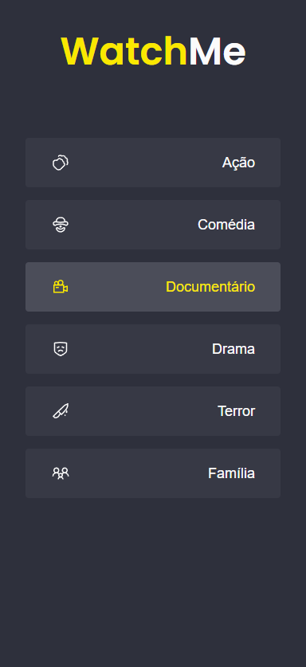
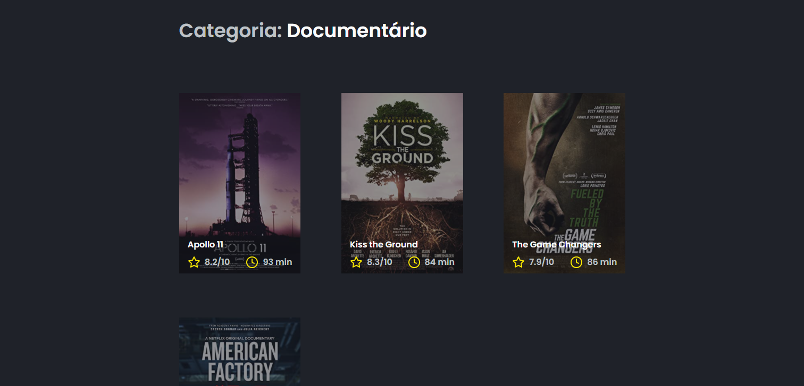
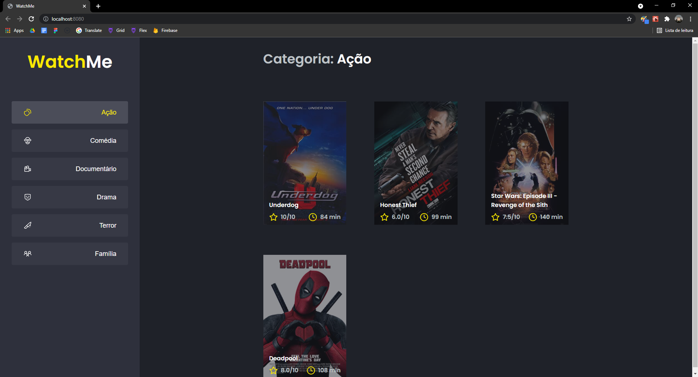
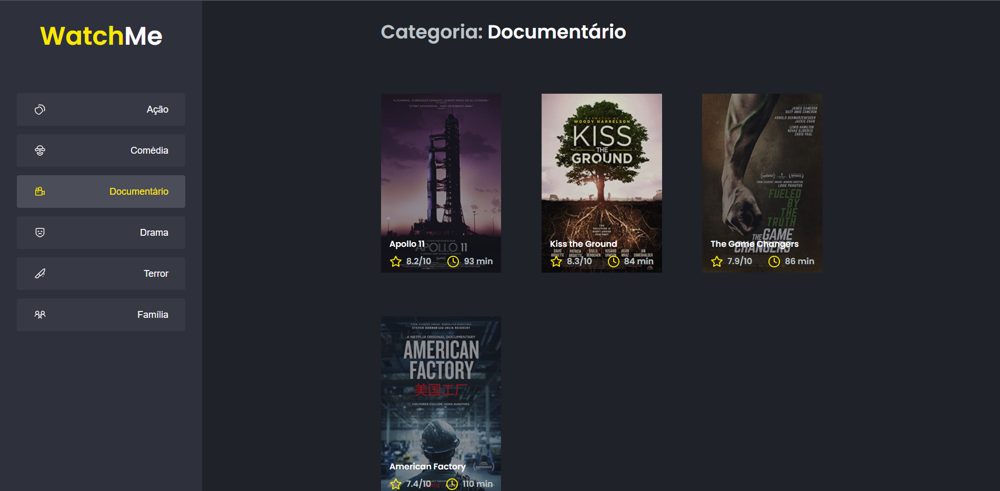

# watch-me

  

<h2>Aplicação</h2>

Uma aplicação rodando com o servidor criado pela Rocketseat. Essa aplicação era um desafio.

<blockquote>
  <cite>Rocketseat</cite>
  
A aplicação está com a lógica toda no componente App.tsx, necessário dividir a aplicação em pelo menos dois componentes a mais, que são o Content.tsx e a SideBar.tsx.

</blockquote>
<h3>SideBar</h3>

---

<h3>Content</h3>

---

<h3>Aplicação final</h3>

---

<h4>Como rodar a aplicação?</h4>
<ol>
  <li>Necessário clonar o repositório "code" como preferir</li>
  <li>Abrir a pasta no VsCode</li>
  <li>Abrir o terminal e rodar o servidor com "yarn server"</li>
  <li>Abrir outro terminal e rodar a aplicação com "yarn dev"</li>
</ol>
